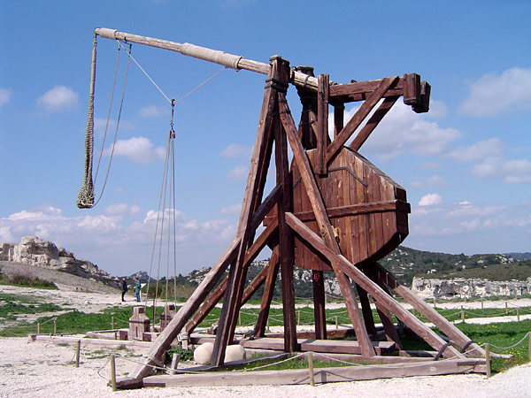

# Ejercicio_conflictos_git

# Presentación
=======
# Trebuchet Medieval
### El mejor trebuchet de la epoca!

# *PRESENTACIÓN*

 EL PROYECTO | INTRUCCIONES OPERACIONALES |
-------------| ----------------------------|
El motivo de este proyecto ha sido construir un trebuchet para lanzar cosas que explotan en el aire, como en el vídeo de Youtube. Ha sido una experiencia muy buena y gratificante. LLena de aprendizaje <3 | |

# *Instalación*
==============
#### Cómo instalar una catapulta
-------------------------
~~~
Para instalar una catapulta, necesitaremos posar sus cuatro puntos de apoyo en un suelo duro. Debido a su elevado peso, cuánto más suro y estable sea el suelo, más aguante y precisión tendrá nuestra catapulta. 
Empezaremos aliniando las pattas con los ejes de sujección. Apretaremos bien fuertee los tornillos de unión de todas las escucadras de madera y por último instalaremos el eje central desde donde fijaremos nuestra goma elástica para tensar la lanzadera.

Por otro lado iremos montando nuestro brazo lanzadera y asegurandonos bien que todos los tornillos y todos nuestros ejes están bien fijados. Solo así conseguiremos más precisión en el tiro.

~~~

**************

##### Aquí un ejemplo 

##### Agradecimientos

* Javier SAnchez Rios
- Marta Sanchez De Haro
- David Picó
- SEr humano
- Gatetes y perretes
+ Los árboles de la madera

